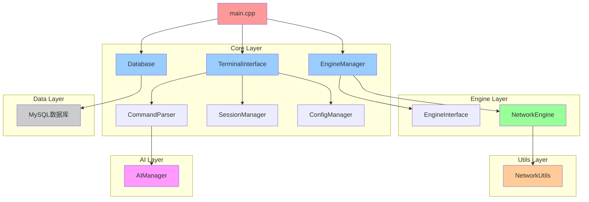
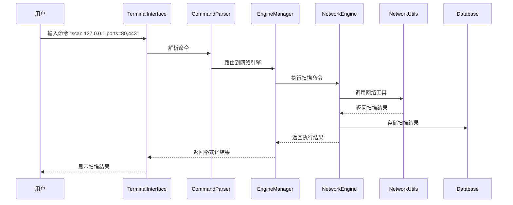

# MindSploit 项目结构文档

## 📁 项目目录结构

```
MindSploit/
├── 📄 README.md                    # 项目概述和快速开始指南
├── 📄 Update_log.md                # 开发日志和版本历史记录
├── 📄 content.md                   # 项目结构说明文档（本文件）
├── 📄 .cursor-rules.yaml           # Cursor IDE 开发规则配置
├── 📄 .gitignore                   # Git 版本控制忽略文件
├── 📄 MindSploit.pro               # Qt qmake 项目配置文件
├── 📄 CMakeLists.txt               # CMake 构建配置文件（备用）
├── 📁 src/                         # 源代码主目录
│   ├── 📄 main.cpp                 # 程序入口点，初始化核心组件
│   ├── 📁 core/                    # 框架核心逻辑模块
│   │   ├── 📄 terminal_interface.h/cpp    # 终端交互界面
│   │   ├── 📄 engine_manager.h/cpp        # 引擎管理器
│   │   ├── 📄 session_manager.h/cpp       # 会话管理器
│   │   ├── 📄 command_parser.h/cpp        # 命令解析器
│   │   ├── 📄 database.h/cpp              # 数据库管理
│   │   └── 📄 config_manager.h/cpp        # 配置管理器
│   ├── 📁 engines/                 # 自主开发的渗透测试引擎
│   │   ├── 📄 engine_interface.h   # 引擎接口基类
│   │   └── 📁 network/             # 网络扫描引擎
│   │       ├── 📄 network_engine.h/cpp   # 网络扫描引擎实现
│   │       └── 📄 network_scanner.h/cpp  # 网络扫描器（规划中）
│   ├── 📁 ai/                      # AI集成模块
│   │   └── 📄 ai_manager.h/cpp     # AI管理器
│   └── 📁 utils/                   # 工具类和辅助函数
│       └── 📄 network_utils.h/cpp  # 网络工具类
├── 📁 docs/                        # 项目文档目录
│   ├── 📄 ARCHITECTURE.md          # 架构设计文档
│   ├── 📄 API_REFERENCE.md         # API参考文档
│   ├── 📄 USER_GUIDE.md            # 用户使用指南
│   ├── 📄 MODULE_DESIGN.md         # 模块设计文档
│   ├── 📄 AI_INTERACTION_DESIGN.md # AI交互设计文档
│   └── 📄 COMMAND_SYSTEM_DESIGN.md # 命令系统设计文档
├── 📁 tests/                       # 测试代码目录
│   ├── 📁 unit/                    # 单元测试
│   ├── 📁 integration/             # 集成测试
│   └── 📁 performance/             # 性能测试
├── 📁 release/                     # 发布版本目录
│   └── 📄 MindSploit.exe           # Windows可执行文件
├── 📁 debug/                       # 调试版本目录
└── 📁 build/                       # 构建临时文件目录
```

## 🏗️ 核心模块说明

### 📄 main.cpp
- **作用**: 程序入口点，负责初始化所有核心组件
- **功能**:
  - 初始化数据库连接
  - 创建终端界面
  - 启动主程序循环
  - 处理程序退出清理

### 🧠 core/ 核心模块

#### terminal_interface.h/cpp
- **作用**: 专业命令行交互界面，类似Metasploit的msfconsole
- **功能**:
  - 命令行提示符和输入处理
  - 彩色输出支持（成功/错误/警告/信息）
  - 命令历史记录和自动补全
  - 信号处理（Ctrl+C优雅中断）
  - 会话状态显示

#### engine_manager.h/cpp
- **作用**: 引擎管理器，负责所有渗透测试引擎的生命周期管理
- **功能**:
  - 引擎注册和发现
  - 引擎加载和卸载
  - 命令路由和执行调度
  - 引擎状态监控

#### session_manager.h/cpp
- **作用**: 会话管理器，处理用户会话和状态维护
- **功能**:
  - 多会话支持
  - 会话变量管理
  - 上下文状态保存
  - 会话切换和恢复

#### command_parser.h/cpp
- **作用**: 智能命令解析器，处理用户输入的命令
- **功能**:
  - 命令语法解析
  - 参数验证和类型转换
  - 命令补全和提示
  - 别名和宏支持

#### database.h/cpp
- **作用**: 数据库管理，负责数据持久化存储
- **功能**:
  - MySQL数据库连接管理
  - 命令历史记录存储
  - 扫描结果数据存储
  - AI对话记录存储
  - 无数据库模式支持

#### config_manager.h/cpp
- **作用**: 配置管理器，处理用户设置和系统配置
- **功能**:
  - 用户偏好设置
  - API密钥管理
  - 引擎配置参数
  - 配置文件读写

### 🔧 engines/ 引擎模块

#### engine_interface.h
- **作用**: 引擎接口基类，定义所有引擎的统一接口规范
- **功能**:
  - 标准化引擎生命周期
  - 统一参数配置接口
  - 执行控制和状态管理
  - 结果处理和报告

#### network/network_engine.h/cpp
- **作用**: 网络扫描引擎，自主开发的网络探测工具
- **功能**:
  - 主机发现（discover命令）
  - 端口扫描（scan命令）
  - 服务识别（service命令）
  - 操作系统识别（os命令）
  - 多线程并发扫描

### 🤖 ai/ AI集成模块

#### ai_manager.h/cpp
- **作用**: AI管理器，处理与AI模型的交互
- **功能**:
  - 多AI模型支持（本地/云端）
  - 智能分析和建议
  - 自然语言命令解析
  - 自动化攻击路径规划

### 🛠️ utils/ 工具模块

#### network_utils.h/cpp
- **作用**: 网络工具类，提供底层网络操作支持
- **功能**:
  - IP地址解析和验证
  - TCP/UDP连接测试
  - ICMP ping实现
  - 端口范围解析
  - 网络接口枚举
  - 跨平台网络支持

## 📊 模块依赖关系图



## 🔄 数据流图



## 🏛️ 架构层次说明

### 1. **表示层 (Presentation Layer)**
- **TerminalInterface**: 用户交互界面
- **命令解析和验证**
- **结果格式化和显示**

### 2. **业务逻辑层 (Business Logic Layer)**
- **EngineManager**: 引擎管理和调度
- **SessionManager**: 会话状态管理
- **CommandParser**: 命令解析和路由

### 3. **引擎层 (Engine Layer)**
- **NetworkEngine**: 网络扫描引擎
- **AIManager**: AI集成引擎
- **扩展引擎接口**

### 4. **工具层 (Utility Layer)**
- **NetworkUtils**: 网络工具类
- **ConfigManager**: 配置管理
- **通用工具函数**

### 5. **数据层 (Data Layer)**
- **Database**: 数据持久化
- **文件系统操作**
- **配置文件管理**

## 🔧 开发指南

### 添加新引擎的步骤：
1. 继承 `EngineInterface` 基类
2. 实现必要的虚函数
3. 在 `EngineManager` 中注册引擎
4. 在 `CommandParser` 中定义相关命令
5. 编写单元测试

### 添加新命令的步骤：
1. 在 `CommandParser::defineBuiltinCommands()` 中定义命令
2. 在对应引擎中实现命令逻辑
3. 更新帮助文档
4. 添加命令测试用例

### 代码规范：
- 使用现代C++17特性
- RAII资源管理
- 智能指针优先
- 异常安全保证
- 跨平台兼容性考虑