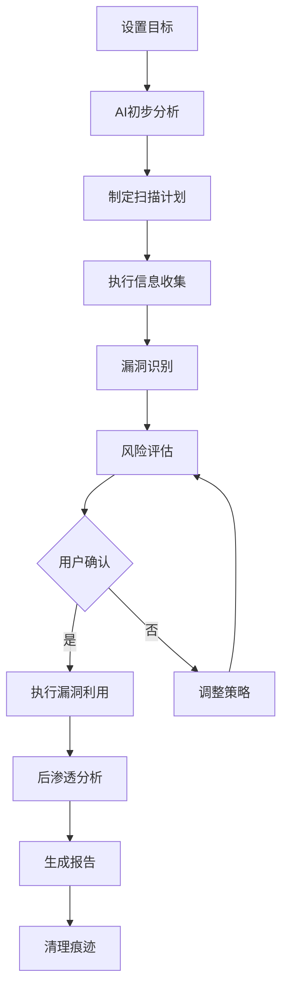

# MindSploit AI交互设计文档

## 🎯 AI集成理念

MindSploit的AI模块设计为独立的智能助手，可以与用户进行自然语言交互，提供专业的渗透测试建议和自动化分析。AI不会替代手动测试，而是作为强大的辅助工具。

## 🤖 AI模式设计

### 双模式操作
```
┌─────────────────────────────────────────────────────────┐
│                   MindSploit 操作模式                    │
├─────────────────────────────────────────────────────────┤
│  手动模式 (Manual Mode)     │  AI辅助模式 (AI Mode)      │
│                            │                           │
│  • 传统命令行操作           │  • 自然语言交互            │
│  • 精确控制每个步骤         │  • 智能建议和分析          │
│  • 专业用户友好             │  • 自动化攻击链            │
│  • 完全可控                │  • 新手友好               │
│                            │                           │
│  MindSploit >              │  [AI] >                   │
└─────────────────────────────────────────────────────────┘
```

### AI模式切换流程
```bash
# 进入AI模式
MindSploit > ai
[AI] 🤖 已进入AI辅助模式
[AI] 当前模型: GPT-4 (OpenAI)
[AI] 输入 'help' 查看AI命令，输入 'exit' 退出AI模式
[AI] 您好！我是MindSploit AI助手，请告诉我您的渗透测试目标。

# AI模式交互
[AI] > 我想测试 192.168.1.100 这个目标
[AI] 🎯 目标已设定: 192.168.1.100
[AI] 正在进行初步分析...
[AI] 建议首先进行端口扫描，是否执行？(y/n)

# 退出AI模式
[AI] > exit
[AI] 👋 已退出AI模式，返回手动操作
MindSploit > 
```

## 🧠 AI模型架构

### 支持的AI模型类型
```yaml
ai_models:
  # 云端大模型
  cloud_models:
    openai:
      - gpt-4: 最强推理能力，适合复杂分析
      - gpt-3.5-turbo: 平衡性能和成本
      - gpt-4-turbo: 快速响应版本
    
    anthropic:
      - claude-3-opus: 强大的分析能力
      - claude-3-sonnet: 平衡版本
      - claude-3-haiku: 快速响应
    
    google:
      - gemini-pro: Google最新模型
      - gemini-pro-vision: 支持图像分析
    
    chinese:
      - qwen-max: 阿里通义千问
      - ernie-bot: 百度文心一言
      - chatglm: 智谱AI
  
  # 本地模型
  local_models:
    ollama:
      - llama2: Meta开源模型
      - codellama: 代码专用模型
      - mistral: 轻量级高效模型
      - neural-chat: Intel优化模型
    
    custom:
      - security-llm: 安全专用训练模型
      - pentest-gpt: 渗透测试专用模型
      - vuln-analyzer: 漏洞分析专用模型
```

### AI模型管理接口
```cpp
class AIModelManager {
public:
    // 模型生命周期
    bool loadModel(const std::string& modelName);
    bool unloadModel(const std::string& modelName);
    bool switchModel(const std::string& modelName);
    
    // 模型查询
    std::vector<std::string> getAvailableModels();
    std::vector<std::string> getLoadedModels();
    std::string getCurrentModel();
    ModelInfo getModelInfo(const std::string& modelName);
    
    // 模型配置
    bool configureModel(const std::string& modelName, const ModelConfig& config);
    bool testModelConnection(const std::string& modelName);
    
    // 性能监控
    ModelStats getModelStats(const std::string& modelName);
    void resetModelStats(const std::string& modelName);
};

struct ModelConfig {
    std::string apiKey;
    std::string endpoint;
    int maxTokens = 4096;
    float temperature = 0.7;
    int timeout = 30;
    bool enableStreaming = true;
};
```

## 🎮 AI交互命令系统

### AI模式专用命令
```bash
# === AI模式控制 ===
ai                          # 进入AI模式
ai exit                     # 退出AI模式
ai help                     # AI命令帮助
ai status                   # AI状态信息

# === 模型管理 ===
ai models                   # 列出所有可用模型
ai model <name>             # 切换到指定模型
ai model info              # 显示当前模型信息
ai model test              # 测试模型连接
ai model config            # 配置模型参数

# === 目标管理 ===
ai target <ip/domain>      # 设置测试目标
ai target info             # 显示目标信息
ai target clear            # 清除目标设置

# === 智能分析 ===
ai analyze                 # 分析当前目标
ai analyze <target>        # 分析指定目标
ai analyze result          # 分析最近的扫描结果
ai suggest                 # 获取下一步建议
ai explain <command>       # 解释命令作用
ai risk <action>           # 评估操作风险

# === 自动化功能 ===
ai auto scan              # 自动扫描目标
ai auto exploit           # 自动漏洞利用
ai auto report            # 自动生成报告
ai plan <objective>       # 制定攻击计划
ai execute plan           # 执行AI制定的计划

# === 学习和优化 ===
ai learn                  # 从当前会话学习
ai optimize <payload>     # 优化载荷
ai translate <command>    # 翻译命令到自然语言
ai history                # AI交互历史
```

### 自然语言交互示例
```bash
# 自然语言查询
[AI] > 如何扫描一个网段？
[AI] 💡 要扫描网段，您可以使用以下方法：
     1. 使用discovery/network/port_scanner模块
     2. 设置RHOSTS为网段范围，如192.168.1.0/24
     3. 执行命令：
        use discovery/network/port_scanner
        set RHOSTS 192.168.1.0/24
        run

# 智能建议
[AI] > 我发现目标开放了22和80端口，下一步该怎么办？
[AI] 🎯 基于开放端口分析：
     • 端口22 (SSH): 建议进行SSH服务枚举和弱密码检测
     • 端口80 (HTTP): 建议进行Web应用扫描和目录枚举
     
     推荐执行顺序：
     1. use auxiliary/scanner/ssh/ssh_version
     2. use discovery/web/dir_scanner
     3. use auxiliary/scanner/http/http_version
     
     是否需要我帮您执行这些扫描？

# 风险评估
[AI] > 评估使用ms17_010漏洞的风险
[AI] ⚠️  MS17-010 (EternalBlue) 风险评估：
     • 成功率: 高 (如果目标未打补丁)
     • 破坏性: 中等 (可能导致系统不稳定)
     • 检测风险: 中等 (会产生网络流量特征)
     • 建议: 在测试环境中先验证，生产环境需谨慎
```

## 🔄 AI工作流程设计

### 智能渗透测试流程


### AI上下文管理
```cpp
class AIContext {
private:
    struct TargetInfo {
        std::string ip;
        std::string domain;
        std::vector<int> openPorts;
        std::map<int, std::string> services;
        std::vector<std::string> vulnerabilities;
        std::string osFingerprint;
    };
    
    struct SessionContext {
        TargetInfo target;
        std::string objective;
        std::vector<std::string> executedCommands;
        std::vector<std::string> findings;
        std::string currentPhase;
        float riskTolerance;
    };
    
public:
    // 上下文管理
    void setTarget(const std::string& target);
    void setObjective(const std::string& objective);
    void addFinding(const std::string& finding);
    void updatePhase(const std::string& phase);
    
    // 智能分析
    std::string analyzeCurrentSituation();
    std::vector<std::string> generateNextSteps();
    std::string assessProgress();
    std::string generateSummary();
};
```

### AI决策引擎
```cpp
class AIDecisionEngine {
public:
    // 决策分析
    Decision analyzeNextAction(const AIContext& context);
    std::vector<Action> generateActionPlan(const std::string& objective);
    float assessActionRisk(const Action& action);
    
    // 智能推荐
    std::vector<Module> recommendModules(const TargetInfo& target);
    std::vector<Payload> recommendPayloads(const ExploitContext& context);
    std::string optimizeCommand(const std::string& command);
    
    // 学习优化
    void learnFromResult(const Action& action, const Result& result);
    void updateStrategy(const std::string& feedback);
};
```

## 📊 AI性能监控

### AI交互统计
```cpp
struct AIStats {
    int totalQueries = 0;
    int successfulQueries = 0;
    float averageResponseTime = 0.0f;
    int tokensUsed = 0;
    float accuracy = 0.0f;
    std::map<std::string, int> commandFrequency;
    std::map<std::string, float> modelPerformance;
};

class AIMonitor {
public:
    void recordQuery(const std::string& query, const std::string& response, float responseTime);
    void recordSuccess(bool success);
    void recordTokenUsage(int tokens);
    AIStats getStats() const;
    void resetStats();
    void exportStats(const std::string& filename);
};
```

### AI配置管理
```yaml
ai_config:
  default_model: "gpt-4"
  fallback_model: "gpt-3.5-turbo"
  max_context_length: 8192
  response_timeout: 30
  retry_attempts: 3
  
  security:
    enable_content_filter: true
    log_conversations: true
    encrypt_api_keys: true
    
  performance:
    enable_caching: true
    cache_duration: 3600
    parallel_requests: false
    
  ui:
    enable_streaming: true
    show_thinking_process: true
    highlight_commands: true
    auto_execute_safe_commands: false
```

这个AI交互设计提供了完整的智能助手功能，既保持了专业渗透测试的精确性，又为新手用户提供了友好的AI指导。用户可以根据需要在手动模式和AI模式之间自由切换。
